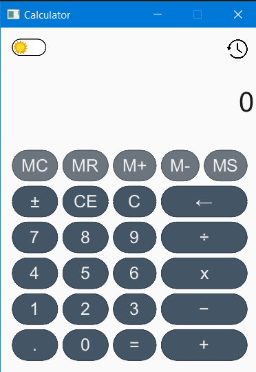
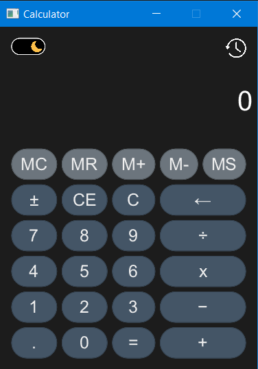

# Rust + Slint Simple Calculator

This is a simple calculator application built with Rust and the Slint UI framework. It was created as a learning project to demonstrate connecting a Rust backend (for logic) to a Slint frontend (for UI).
<div style="display: flex; justify-content: center; gap: 20px;">
  <div>
    
    <p align="center"><em>Light mode</em></p>
  </div>
  <div>
    
    <p align="center"><em>Dark mode</em></p>
  </div>
</div>

# Features

This calculator includes all standard functions and several bonus features.

## Core Features

**Basic Operations:** Addition (+), Subtraction (−), Multiplication (×), and Division (÷).

**Full Decimal Support:** Handles floating-point numbers correctly.

**Error Handling:** Displays "Error" on invalid operations, such as division by zero.


**Control Buttons:**

- C: Clears all current operations and state.

- CE: Clears current entry.

- ←: Backspace to delete the last entered digit.

- ±: Toggles the sign of the current number.

**Repeat Operation:** Repeatedly pressing = repeats the last operation (e.g., 5 + 2 = = results in 9).

## Bonus Features

**Theme Toggle:** A "☀️ / 🌙" toggle button to switch between light and dark modes.

**Calculation History:** A history icon opens an overlay panel showing a list of all previous calculations.

**Memory Functions:**

- MS: Memory Store - Saves the current number to memory.

- MR: Memory Recall - Recalls the number from memory to the display.

- MC: Memory Clear - Clears the memory.

- M+ / M-: Adds or subtracts the current number from the value in memory.

- An "M" indicator appears when a value is stored in memory.

**Keyboard Input:** The calculator fully supports keyboard and numpad input for all numbers, operators, and functions (e.g., Enter for =, Backspace for ←, c for C).

# Architecture

The project is structured in three main parts as specified by the assignment:

**src/ui.slint:** Defines the entire UI layout, components, and styling using Slint's markup. It also contains the keyboard mapping logic, which calls the main button-pressed callback.

**src/calc.rs:** Contains the core calculator logic in a CalculatorState struct. This file is pure Rust with no UI dependencies. It handles all state, logic, and error handling, and is covered by unit tests.

**src/main.rs:** The main Rust entry point. It initializes the Slint UI, creates an instance of CalculatorState, and connects them. It does this by handling the button-pressed callback from Slint, passing the input to the calc module, and then updating the UI properties with the new state.

**build.rs:** A simple build script that uses slint-build to compile the src/ui.slint file at build time, allowing the Rust code to use it.

## How to Build and Run

### Prerequisites

- Rust and Cargo

- The Slint build tools. You can install them with Cargo:

`cargo install slint-build`

### Running the Application

Clone the repository:
```
git clone https://github.com/Enolami/Rust-calculator
cd simple_calculator
```

Build and run the project:

### This will build and run in debug mode
cargo run

### For a faster, optimized version:
cargo run --release


### Running Tests

To run the unit tests for the calculator logic:

cargo test
